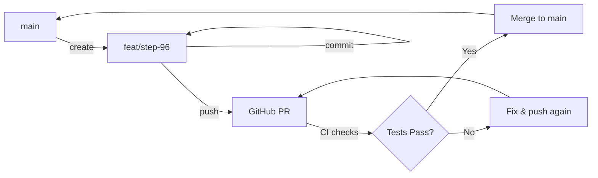

# Git & GitHub Workflow

> **Professional GitHub workflow for solo developers**  
> Designed for non-coders managing a technical project

---

## Table of Contents
1. [Quick Reference](#quick-reference)
2. [Daily Workflow](#daily-workflow)
3. [Feature Branch Strategy](#feature-branch-strategy)
4. [Commit Guidelines](#commit-guidelines)
5. [Pull Request Process](#pull-request-process)
6. [Release & Tagging](#release--tagging)
7. [Troubleshooting](#troubleshooting)

---

## Quick Reference

### Basic Commands
```bash
# Check status
git status

# See what changed
git diff

# Stage all changes
git add .

# Commit with message
git commit -m "feat: Step 95 - description"

# Push to GitHub
git push origin main

# Pull latest from GitHub
git pull origin main
```

### Emergency Rollback
```bash
# See recent commits
git log --oneline -10

# Revert to previous commit (safe, creates new commit)
git revert HEAD

# Hard reset (DANGEROUS - use only if certain)
git reset --hard HEAD~1
```

---

## Daily Workflow

### Starting a New Step

```bash
# 1. Make sure you're on main and up to date
git checkout main
git pull origin main

# 2. Create feature branch (recommended even for solo work)
git checkout -b feat/step-96-description

# 3. Copy previous Step file
cp "Step 95 — Unit Detail full term pricing from unit baseline.html" \
   "Step 96 — [new feature].html"

# 4. Make your changes
# - Edit Step 96 HTML file
# - Update src/js/*.js files as needed
# - Update tests if applicable
```

### Committing Changes

```bash
# 1. Check what you changed
git status
git diff

# 2. Stage files (pick one approach):

# Option A: Stage everything
git add .

# Option B: Stage specific files
git add "Step 96 — [new feature].html"
git add src/js/pricing-unit.js
git add tests/unit-details.spec.ts
git add CHANGELOG.md
git add README.md

# 3. Commit with descriptive message
git commit -m "feat: Step 96 - add export to Excel functionality

- Add Excel export button to New Pricing tab
- Create exportToExcel() function in pricing-helpers.js
- Update CHANGELOG.md with Step 96 entry
- Add Playwright test for export button"

# 4. Push to GitHub
git push origin feat/step-96-description
```

### Merging to Main

```bash
# Option A: Merge via GitHub (RECOMMENDED)
# 1. Go to GitHub.com → Your Repo → Pull Requests
# 2. Click "New Pull Request"
# 3. Fill out template
# 4. Wait for CI checks
# 5. Click "Merge Pull Request"
# 6. Update local main:
git checkout main
git pull origin main

# Option B: Merge locally (only if skipping PR)
git checkout main
git merge feat/step-96-description
git push origin main

# Clean up branch
git branch -d feat/step-96-description
git push origin --delete feat/step-96-description
```

---

## Feature Branch Strategy

### Why Use Branches (Even Solo)?

✅ **Benefits:**
- Clean main branch history
- CI checks run before merging
- Easy to revert failed experiments
- Professional practices for future team growth
- Clear separation between stable and experimental

### Branch Naming Convention

```bash
# Features
feat/step-95-unit-term-pricing
feat/step-96-excel-export

# Bug fixes
fix/step-95-amenity-calculation
fix/unit-pricing-filter-bug

# Documentation
docs/update-readme-step-95
docs/add-architecture-diagrams

# Refactoring
refactor/simplify-pricing-logic
refactor/extract-common-helpers
```

### Branch Workflow



---

## Commit Guidelines

### Conventional Commits Format

```
<type>(<scope>): <subject>

<body>

<footer>
```

### Types

| Type | When to Use | Example |
|------|-------------|---------|
| `feat` | New feature or Step | `feat: Step 95 - unit term pricing` |
| `fix` | Bug fix | `fix: correct amenity adjustment calculation` |
| `refactor` | Code restructuring, no behavior change | `refactor: extract helper functions` |
| `docs` | Documentation only | `docs: update README with Step 95` |
| `test` | Add or update tests | `test: add Playwright tests for unit details` |
| `chore` | Maintenance, dependencies | `chore: update npm packages` |
| `style` | Formatting, no code change | `style: fix indentation in pricing-unit.js` |

### Good Commit Messages

```bash
# ✅ GOOD - Clear, descriptive, includes what and why
git commit -m "feat: Step 95 - add unit detail term pricing table

- Compute unit baseline (FP baseline + amenity adjustment)
- Display 2-14 month term breakdown in detail panel
- Apply short-term premium, over-cap, and seasonality
- Add comprehensive Playwright tests
- Update CHANGELOG and README

Closes #42"

# ✅ GOOD - Simple fix with context
git commit -m "fix: correct short-term premium calculation

Short-term premium was applying to 10-month terms.
Changed logic to apply only to terms < 10 months.

Fixes #43"

# ❌ BAD - Too vague
git commit -m "update stuff"

# ❌ BAD - Too generic
git commit -m "fix bug"

# ❌ BAD - No context
git commit -m "changes"
```

### Multi-line Commit Messages

For complex changes:

```bash
git commit -m "feat: Step 96 - Excel export with formatted tabs" -m "
Added Excel export functionality:
- New exportToExcel() function in pricing-helpers.js
- Export button on New Pricing and Renewals tabs
- Three worksheets: New Pricing, Renewals, Settings
- Formatted headers, currency columns, freeze panes

Dependencies:
- Added SheetJS (xlsx) library via CDN

Testing:
- Manual test with 300-unit rent roll
- Verified Excel opens correctly in Excel/Google Sheets
- Tested on Chrome, Firefox, Safari

Updates:
- CHANGELOG.md: Added Step 96 entry
- README.md: Updated current version to Step 96
- tests/smoke.spec.ts: Added export button test
"
```

---

## Pull Request Process

### 1. Create Pull Request

**Via GitHub Web:**
1. Push your branch: `git push origin feat/step-96-description`
2. Go to GitHub → Your Repo
3. Click "Compare & pull request" button (appears after push)
4. Fill out PR template

**Via Command Line:**
```bash
# Using GitHub CLI (if installed)
gh pr create --title "feat: Step 96 - Excel export" \
             --body "$(cat .github/pull_request_template.md)"
```

### 2. PR Template Checklist

```markdown
## Step Number
Step 96

## Type of Change
- [x] New feature
- [ ] Bug fix
- [ ] Refactoring (no behavior change)
- [ ] Documentation update

## Description
Adds Excel export functionality to New Pricing and Renewals tabs.
Operators can now download pricing data in formatted Excel workbooks.

## Changes Made
- Added `exportToExcel()` function to `pricing-helpers.js`
- Added export buttons to New Pricing and Renewals tabs
- Included SheetJS library via CDN
- Updated `Step 96.html` with export functionality

## Testing Done
### Manual Smoke Check
- [x] Page loads without errors
- [x] CSV upload works
- [x] New Pricing renders correctly
- [x] Export button generates Excel file
- [x] Excel file opens in Excel and Google Sheets
- [x] All data exported correctly

### Automated Tests
- [x] Boundary tests: 11/11 passed
- [x] Smoke tests: 4/4 passed (will run in CI)
- [x] Export button test added

## Documentation
- [x] CHANGELOG.md updated
- [x] README.md updated
- [x] Comments added to new code

## Breaking Changes
- [ ] This PR includes breaking changes

## Screenshots (if applicable)
[Attach screenshot of export button and generated Excel file]
```

### 3. Wait for CI Checks

GitHub Actions will automatically run:
- ✅ ESLint (code quality)
- ✅ Jest boundary tests (11 tests)
- ⚠️ Playwright smoke tests (may fail on macOS, passes on Linux)

### 4. Review Your Own PR

Even though you're solo, review the "Files changed" tab:
- ✅ No accidental changes
- ✅ No sensitive data committed
- ✅ No debug console.logs left in
- ✅ Formatting looks clean

### 5. Merge

**If CI passes:**
```bash
# On GitHub, click "Merge pull request"
# Choose: "Squash and merge" (recommended for clean history)

# Then locally:
git checkout main
git pull origin main
git branch -d feat/step-96-description  # Delete local branch
```

---

## Release & Tagging

### When to Tag

Tag a release when:
- ✅ New Step is complete and tested
- ✅ All CI checks pass
- ✅ Manual smoke test passes
- ✅ Documentation is updated

### Semantic Versioning

```
v[MAJOR].[MINOR].[PATCH]

v1.95.0 = Step 95 (new feature)
v1.95.1 = Hotfix for Step 95
v2.0.0 = Major breaking change
```

**Recommended for Steps:**
- Use Step number as minor version: `v1.95.0` = Step 95
- Increment patch for hotfixes: `v1.95.1` = Bug fix in Step 95

### Creating a Tag

```bash
# 1. Make sure you're on main and up to date
git checkout main
git pull origin main

# 2. Create annotated tag
git tag -a v1.95.0 -m "Release: Step 95 - Unit detail term pricing

Added full term pricing breakdown (2-14 months) in unit detail panel.

Features:
- Unit baseline calculation (FP baseline + amenity adjustment)
- Term-by-term pricing with premiums applied
- Clean table presentation matching FP style
- Comprehensive Playwright tests

Testing:
- ✅ Boundary tests: 11/11 passed
- ✅ Manual smoke test completed
- ✅ All functionality verified

Breaking Changes: None

Supersedes: Step 94"

# 3. Push tag to GitHub
git push origin v1.95.0

# Or push all tags:
git push origin --tags
```

### Creating a GitHub Release

**Via GitHub Web:**
1. Go to GitHub → Your Repo → Releases
2. Click "Draft a new release"
3. Click "Choose a tag" → Select `v1.95.0`
4. Release title: `Step 95: Unit Detail Term Pricing`
5. Description:
   ```markdown
   ## 🎉 What's New in Step 95
   
   Added full term pricing breakdown (2-14 months) in the unit detail panel.
   
   ### Features
   - 📊 **Term Pricing Table**: See prices for all lease terms (2-14 months)
   - 💰 **Unit Baseline**: FP baseline + amenity adjustment
   - 📈 **Smart Premiums**: Short-term, over-cap, and seasonality applied
   - ✅ **Well Tested**: Comprehensive Playwright test coverage
   
   ### Files Changed
   - `Step 95 — Unit Detail full term pricing from unit baseline.html`
   - `src/js/pricing-unit.js` - Added term pricing functions
   - `src/js/pricing-helpers.js` - Exposed helper functions
   - `tests/unit-details.spec.ts` - New term pricing tests
   
   ### Testing
   - ✅ Boundary tests: 11/11 passed
   - ✅ Manual smoke test completed
   - ✅ Zero behavior changes to existing features
   
   ### Documentation
   - Updated README.md
   - Updated CHANGELOG.md
   - Updated WORKFLOW.md
   
   See [CHANGELOG.md](CHANGELOG.md) for full details.
   
   ---
   
   **Previous Release:** [Step 94](link-to-step-94-release)  
   **Next Up:** Step 96 (TBD)
   ```
6. Attach `Step 95 — Unit Detail full term pricing from unit baseline.html`
7. Click "Publish release"

---

## Troubleshooting

### Common Issues

#### "Your branch is ahead of 'origin/main' by N commits"

```bash
# You have local commits not pushed yet
git push origin main
```

#### "Your branch is behind 'origin/main' by N commits"

```bash
# Someone (or you on another machine) pushed to GitHub
git pull origin main
```

#### "Merge conflict"

```bash
# 1. See conflicted files
git status

# 2. Open conflicted files, look for:
<<<<<<< HEAD
Your changes
=======
Their changes
>>>>>>> branch-name

# 3. Manually resolve (delete markers, keep desired code)

# 4. Stage resolved files
git add <resolved-file>

# 5. Complete merge
git commit -m "merge: resolve conflicts"
```

#### "I committed to wrong branch"

```bash
# Move last commit to a new branch
git branch feat/step-96-oops
git reset --hard HEAD~1
git checkout feat/step-96-oops
```

#### "I need to undo last commit"

```bash
# Option 1: Keep changes, undo commit
git reset --soft HEAD~1

# Option 2: Discard changes AND commit (DANGEROUS)
git reset --hard HEAD~1

# Option 3: Create a new commit that undoes changes (SAFE)
git revert HEAD
```

#### "I pushed but need to undo"

```bash
# NEVER use force push on main
# Instead, revert and push a new commit
git revert HEAD
git push origin main
```

#### "CI is failing but code works locally"

**Common causes:**
- **Chromium issue on macOS**: Tests pass in CI (Linux) but fail locally
- **Missing dependencies**: CI runs `npm ci` which is strict
- **Environment differences**: Check Node version matches CI

**Solutions:**
1. Check CI logs on GitHub Actions tab
2. Verify all dependencies in `package.json`
3. Test with `npm ci` locally (clean install)
4. Check if it's just Playwright (known macOS Sequoia issue)

---

## Best Practices

### ✅ DO

- ✅ **Commit early, commit often** - Small commits are easier to review/revert
- ✅ **Use descriptive messages** - Future you will thank you
- ✅ **Test before pushing** - Run `npm run test:boundaries` at minimum
- ✅ **Update docs with code** - CHANGELOG, README in same commit
- ✅ **Use branches** - Even solo, it's professional
- ✅ **Tag releases** - Makes rollback easy
- ✅ **Review your own PRs** - Catch mistakes before merge

### ❌ DON'T

- ❌ **Don't commit secrets** - API keys, passwords, tokens
- ❌ **Don't force push to main** - Unless absolutely certain
- ❌ **Don't commit directly to main** - Use branches + PRs
- ❌ **Don't use generic messages** - "fix stuff" tells you nothing
- ❌ **Don't skip testing** - CI is there for a reason
- ❌ **Don't commit commented code** - Delete it or use git history
- ❌ **Don't commit node_modules** - Let npm install handle it

---

## GitHub Settings (Recommended)

### Branch Protection Rules

**Settings → Branches → Add rule for `main`:**

- ✅ Require pull request before merging
- ✅ Require status checks to pass before merging
  - Required checks: `ESLint`, `Boundary Tests`
- ✅ Require branches to be up to date before merging
- ⚠️ Don't require approvals (you're solo)
- ✅ Dismiss stale reviews when new commits are pushed
- ❌ Don't allow force pushes
- ❌ Don't allow deletions

### Secrets (for future CI enhancements)

**Settings → Secrets and variables → Actions:**

If you need API keys for CI:
```bash
# Example: Slack notifications
SLACK_WEBHOOK_URL=https://hooks.slack.com/...
```

---

## Quick Command Reference

```bash
# Status & Info
git status                    # What changed
git log --oneline -10        # Last 10 commits
git diff                     # See unstaged changes
git diff --staged            # See staged changes
git branch                   # List branches
git remote -v                # Show remotes

# Branching
git checkout -b feat/name    # Create and switch to branch
git checkout main            # Switch to main
git branch -d feat/name      # Delete branch
git push origin --delete feat/name  # Delete remote branch

# Staging & Committing
git add .                    # Stage all
git add file.js              # Stage specific file
git commit -m "message"      # Commit staged
git commit --amend           # Edit last commit

# Pushing & Pulling
git push origin main         # Push to main
git pull origin main         # Pull from main
git push origin --tags       # Push all tags

# Undoing
git reset --soft HEAD~1      # Undo commit, keep changes
git reset --hard HEAD~1      # Undo commit, discard changes
git revert HEAD              # Create new commit that undoes

# Tagging
git tag v1.95.0              # Create lightweight tag
git tag -a v1.95.0 -m "msg"  # Create annotated tag
git push origin v1.95.0      # Push specific tag
git push origin --tags       # Push all tags

# Cleaning
git clean -fd                # Remove untracked files
git stash                    # Temporarily save changes
git stash pop                # Restore stashed changes
```

---

## Helpful Aliases (Optional)

Add to `~/.gitconfig`:

```ini
[alias]
    st = status
    co = checkout
    br = branch
    ci = commit
    cm = commit -m
    unstage = reset HEAD --
    last = log -1 HEAD
    visual = log --graph --oneline --all
    amend = commit --amend --no-edit
```

Then use:
```bash
git st              # Instead of git status
git co main         # Instead of git checkout main
git cm "message"    # Instead of git commit -m "message"
```

---

## Additional Resources

- [Conventional Commits](https://www.conventionalcommits.org/)
- [Semantic Versioning](https://semver.org/)
- [Git Cheat Sheet](https://education.github.com/git-cheat-sheet-education.pdf)
- [GitHub Flow](https://docs.github.com/en/get-started/quickstart/github-flow)

---

*For project-specific workflow, see [WORKFLOW.md](WORKFLOW.md)*  
*For code contribution guidelines, see [CONTRIBUTING.md](CONTRIBUTING.md)*

